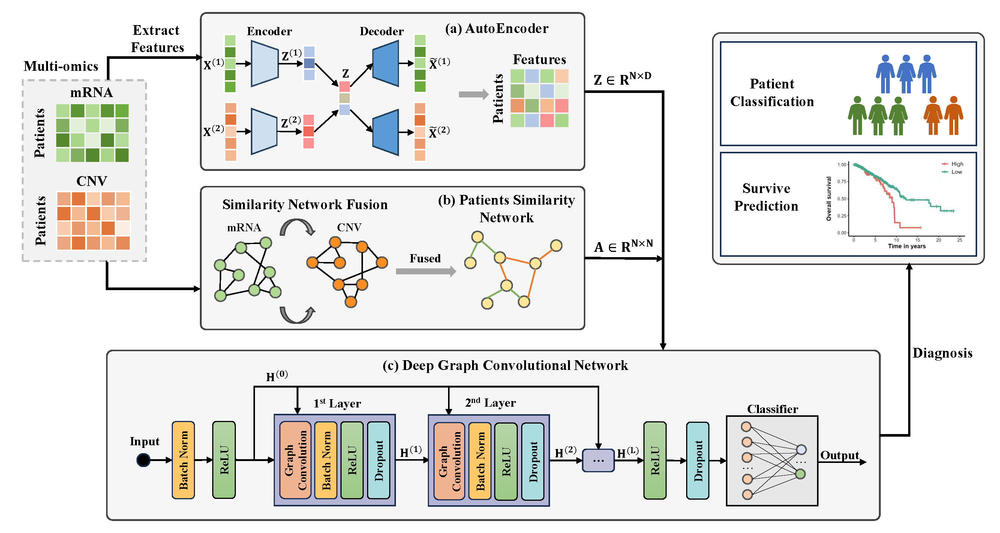

## DeepMoIC: Multi-Omics Data Integration via Deep Graph Convolutional Networks for Cancer Subtype Classification



### Quick start

```
git clone git@github.com:JiechengWu/DeepMoIC.git
```

Unzip the data in the data and results, then if you want to run the classification task：
```
python main.py --dataset BRCA -wd 0.01 -lr 0.001 -dp 0.3 -p 20 --layer 20
python main.py --dataset KIPAN -wd 0.001 -lr 0.005 -dp 0.3 -p 20 --layer 16
python main.py --dataset LGG -wd 0.01 -lr 0.001 -dp 0.4 -p 50 --layer 8
```

Get the fusion feature and PSN_adj by:
```
python AE_run.py
python SNF_run.py
```

### Requirements

python == 3.7.8

pytorch == 1.10.2

numpy == 1.21.6

pandas==1.3.5

scikit-learn==0.20.0

snfpy==0.2.2

Please cite this paper by:
```
@article{wu2024deepmoic,
  title={DeepMoIC: multi-omics data integration via deep graph convolutional networks for cancer subtype classification},
  author={Wu, Jiecheng and Chen, Zhaoliang and Xiao, Shunxin and Liu, Genggeng and Wu, Wenjie and Wang, Shiping},
  journal={BMC genomics},
  volume={25},
  number={1},
  pages={1--13},
  year={2024},
  publisher={Springer}
}
```

### Reference

[1] M. Chen, Z. Wei, Z. Huang et al. Simple and deep graph convolutional networks. In: Proceedings of the 37th International Conference on Machine Learning 2020;pp.1725-1735.

[2] Li X, Ma J, Leng L et al. MoGCN: A multi-omics integration method based on graph convolutional network for cancer subtype analysis. Front Genet 2022;13:127

